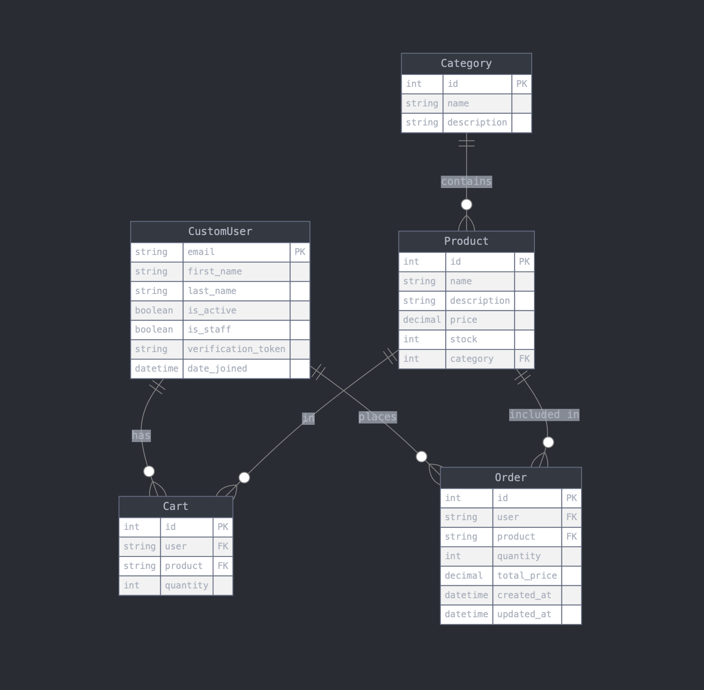

# Coffee Shop Backend API

## Описание

Это приложение — REST API для управления пользователями, товарами, корзиной и заказами для сети кофеен. Пользователи могут регистрироваться, авторизоваться, добавлять товары в корзину и оформлять заказы.

Проект реализован с использованием фреймворка **Django**, **Django REST Framework**, **Celery**, **Redis**, базы данных **PostgreSQL**, аутентификации через **JWT**, контейнеризации с помощью **Docker**, оркестрация с помощью **Docker compose**, **Websocket** для чата.

API документировано с помощью **Swagger** для удобства тестирования и взаимодействия с фронтендом.

---

## Основные функции

1. **Управление пользователями**
   - Регистрация, авторизация и верификация пользователей
   - JWT аутентификация
   - Очистка не верифицированных пользователей через 2 дня при помощи **Celery**

2. **Управление заказами**
   - CRUD операции для заказов

3. **Управление меню**
   - CRUD операции для категорий и продуктов

4. **Корзина**
   - Добавление и удаление товаров из корзины

5. **Чат поддержки**
   - Простой чат, реализован с использованием **WebSocket** и **JS**
   - Доступен по адресу `http://localhost:8000/support-chat/`

6. **Фильтры для GET маршрутов**
   - Сортировка, фильтры по полям и пагинация

7. **Статичная информация**
   - API для получения информации о расположении, графике работы и других статичных данных

8. **Защита данных**
   - Защита от CSRF, XSS и SQL инъекций

---

## Документация

Документация для тестирования API доступна по адресу:

- Swagger UI: `http://localhost:8000/api/docs`


## Маршруты API
### Префикс `/api/`, например `http://localhost:8000/api/register`
### 1. Управление пользователями
- `POST /register` — Регистрация пользователя
- `POST /authentication` — Авторизация пользователя
- `POST /verification` — Подтверждение личности пользователя после регистрации (в данной тестовой версии реализации Token для верификации выводится в консоль контейнера **django**)
- `POST /me` — Получение информации о текущем пользователе
- `GET /users` — Получение всех пользователей
- `GET /user/:id` — Получение одного пользователя
- `PUT /user/:id` — Изменение данных пользователя
- `PATCH /user/:id` — Редактирование данных пользователя
- `DELETE /user/:id` — Удаление пользователя

### 2. Управление категориями
- `POST /category` — Создание категории
- `GET /category` — Получение всех категорий
- `GET /category/:id` — Получение одной категории
- `PUT /category/:id` — Изменение категории
- `PATCH /category/:id` — Редактирование категории
- `DELETE /category/:id` — Удаление категории

### 3. Управление продуктами
- `POST /product` — Создание продукта
- `GET /product` — Получение всех продуктов
- `GET /product/:id` — Получение одного продукта
- `PUT /product/:id` — Изменение продукта
- `PATCH /product/:id` — Редактирование продукта
- `DELETE /product/:id` — Удаление продукта

### 4. Управление заказами
- `POST /order` — Создание заказа
- `GET /order` — Получение всех заказов
- `GET /order/:id` — Получение одного заказа
- `PUT /order/:id` — Изменение заказа
- `PATCH /order/:id` — Редактирование заказа
- `DELETE /order/:id` — Удаление заказа

### 5. Работа с JWT
- `POST /access` — Получение токена
- `POST /refresh` — Обновление токена

### 6. Управление корзиной
- `POST /cart` — Добавление товара в корзину
- `DELETE /cart/:id` — Удаление одного товара из корзины
- `DELETE /cart/` — Очистка корзины

### 7. Статичная информация
- `GET /static-info` — Получение статичной информации (например, расположение, график работы)

---

## Установка

### 1. Клонировать репозиторий
1.1 Для начала клонируйте репозиторий на свою локальную машину:

```bash
git clone https://github.com/darkweid/coffee-shop-backend
cd coffee-shop-backend
```
1.2 Переименуйте файл `.env.example` в `.env`

Можно использовать команду `mv`:

```bash
mv .env.example .env
```


### 2. Установить Docker и Docker Compose
Убедитесь, что у вас установлены Docker и Docker Compose. Если они не установлены, следуйте инструкциям:

- [Установка Docker](https://docs.docker.com/get-docker/)
- [Установка Docker Compose](https://docs.docker.com/compose/install/)

### 3. Запуск проекта с помощью Makefile

Используйте Makefile для упрощения работы с Docker. Все команды для работы с проектом можно выполнить через `make`.

---

#### Быстрый первый старт
```bash
make first-run
```

Эта команда выполнит сборку образов, запустит контейнеры в фоновом режиме, применит миграции к БД и начнет создание **superuser** (админ)

После запуска приложение будет доступно по адресу: `http://localhost:8000`

Административная панель по адресу: `http://localhost:8000/admin/`

---

#### Сборка и запуск контейнеров

Чтобы собрать и запустить все контейнеры (Django, PostgreSQL, Redis, Celery), используйте команду:

```bash
make run
```

Эта команда выполнит сборку образов и запустит контейнеры в фоновом режиме.

#### Остановка контейнеров

Для остановки всех контейнеров используйте:

```bash
make down
```

#### Очистка и удаление контейнеров, образов и томов

Чтобы полностью очистить проект, включая удаление всех контейнеров, образов и томов, используйте:

```bash
make clean
```

### 4. Миграции и начальная настройка

#### Создание миграций

После внесения изменений в модели данных выполните команду для создания миграций:

```bash
make migrations
```

#### Применение миграций

Чтобы применить миграции к базе данных, используйте:

```bash
make migrate
```

#### Создание статических файлов

Для сборки статических файлов в проекте используйте:

```bash
make collectstatic
```

#### Создание суперпользователя

Чтобы создать суперпользователя (админа) Django через командную строку, выполните:

```bash
make createsuperuser
```


### 5. Доступ к контейнерам

#### Доступ к контейнеру Django через bash

Чтобы получить доступ к контейнеру Django и работать в нем, используйте команду:

```bash
make shell
```

#### Просмотр логов

Для просмотра логов всех сервисов:

```bash
make logs
```

Для просмотра логов только Django или Celery:

```bash
make logs-django
```

```bash
make logs-celery
```


## Блок-схема базы данных



## Лицензия

MIT License. См. файл [LICENSE](LICENSE) для подробностей.